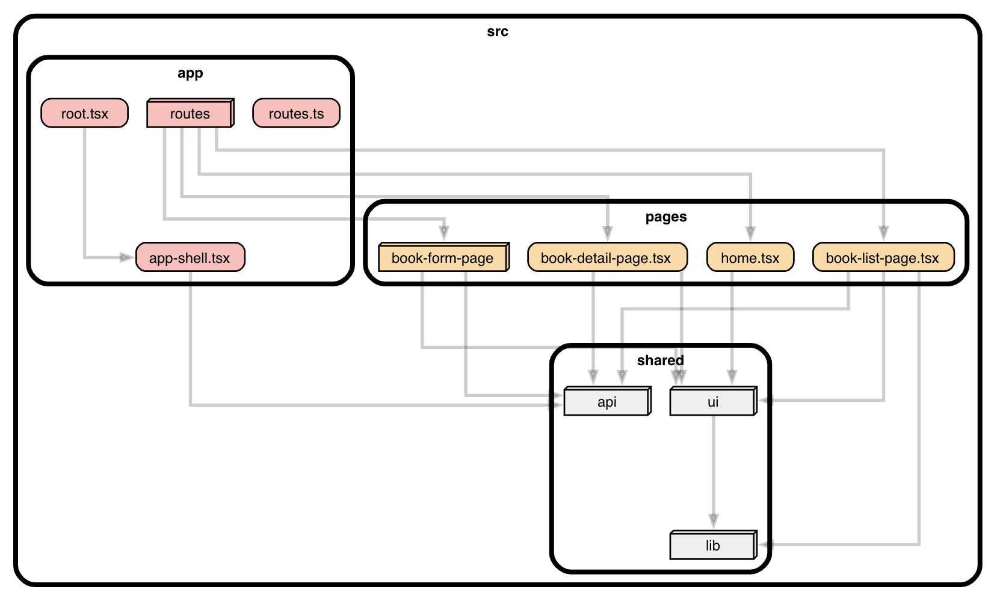

# React Router SPA Demo の SPA 部分

## 技術スタック

- React v19
- React Router v7
- TypeScript v5.8
- Vite v6
- shadcn/ui
- TailwindCSS v4

## アーキテクチャ

[FSD 2.1](https://feature-sliced.design/ja/) を採用



<details>
  <summary><strong>ディレクトリ構成</strong></summary>

```plaintext
src/
  app/
    routes/

  pages/ ... [必須] アプリケーションの画面(いわゆるページに限らない。スクリーンやアクティビティと同義)を定義する
    [page-name]/ ... セグメントを分けるほどでもなければ `[page-name].tsx` とする
      ui/ .... UI コンポーネントを定義する。ディレクトリにするほどでもなければ、ui.tsx として定義する
      model/ ... Page で扱う固有のデータ型やスキーマ
      api/ ... Page 固有のビジネスロジック
      index.ts ... Page の Public API を export

  widgets/ ... 複数の Page で再利用される UI ブロックを定義する
    [widget-name]/ ... セグメントを分けるほどでもなければ `[widget-name].tsx` とする
      ui/ .... Widget を定義する UI
      model/ ... Widget で扱う固有のデータ型やスキーマ
      api/ ... Widget 固有のビジネスロジック
      index.ts ... Widget の Public API を export

  features/ ... 複数の Page や Widget で共有される機能を定義する
    [feature-name]/
      ui/ .... Feature を定義する UI
      model/ ... Feature で扱う固有のデータ型やスキーマ
      api/ ... Feature 固有のビジネスロジック
      index.tx ... Feature の Public API を export

  entities/ ... API や DB の型ではなく、現実世界に則したドメインモデル (コンテンツ・モデル)
    [entity-name]/
      ui/ .... Entity を視覚的に表現する共通の UI コンポーネントを定義する
      model/ ... Entity の型やスキーマを定義する
      api/ ... Entity 固有の API を呼び出す関数があれば定義する
      index.ts ... Entity の Public API を export

  shared/ .. `ui` と `lib` のみ、グルーピングが可能
    api/ ...
      index.ts ... API 関連の Public API を export

    ui/ ... 共通の UI コンポーネントを定義する
      button.tsx 

    lib/ ... 内部ライブラリを定義する
      [lib-name]/ ... あるいは [lib-name].ts として定義する
        index.ts ... ライブラリの Public API を export
```
</details>

<details>
  <summary><strong>資料</strong></summary>

- クイックスタート
  - https://feature-sliced.design/ja/docs/get-started
- ガイド
  - https://feature-sliced.design/ja/docs/guides  
- リファレンス
  - https://feature-sliced.design/ja/docs/reference
</details>


## 開発サーバーの起動

```bash
npm run dev
```

## ビルド

```bash
npm run build
```

## ビルド結果のプレビュー

```bash
npm run start
```
